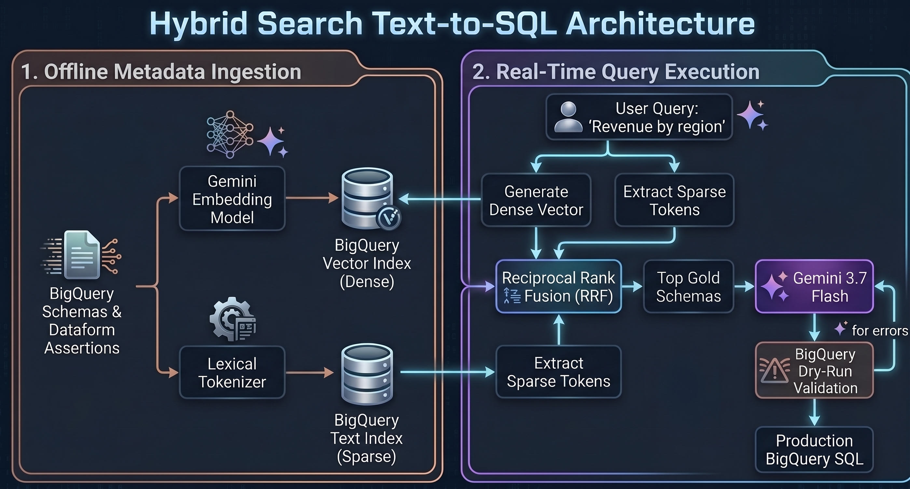
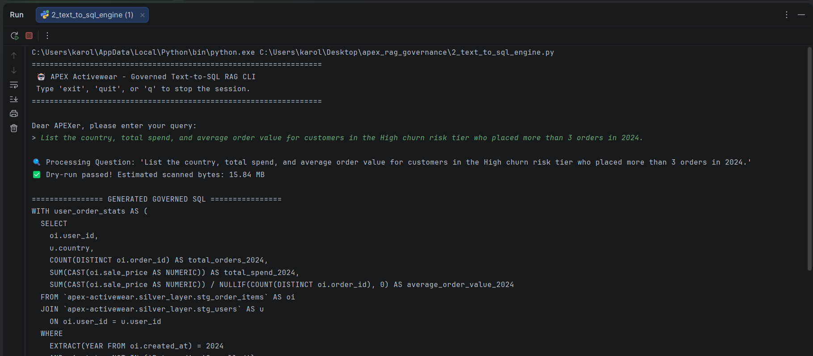
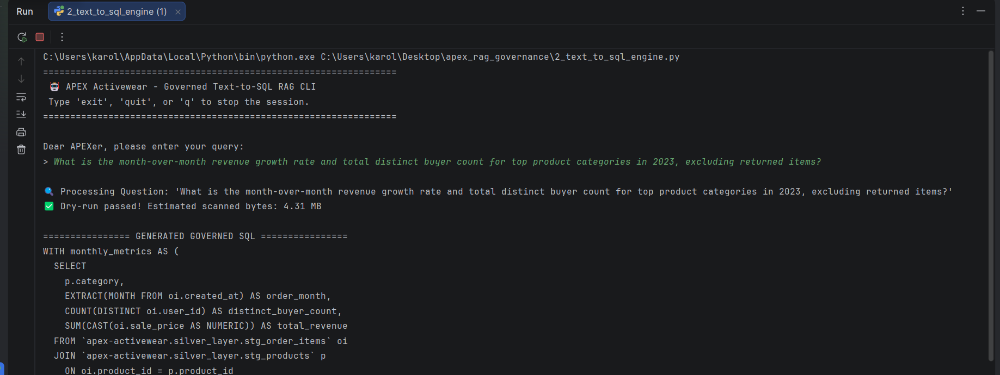

# Governed Text-to-SQL Agent for APEX Activewear


## ⚠️ Context & Business Problem: Hallucinated Analytics
**APEX Activewear** is a $48.85M e-commerce enterprise powered by a BigQuery and Cloud Dataform Medallion architecture. While the pipeline successfully processes over 436K+ orders, non-technical stakeholders faced a critical bottleneck: extracting actionable insights required waiting on the data team to write custom SQL. 

To enable self-service, stakeholders attempted using out-of-the-box LLMs to query the warehouse directly. However, raw models inherently **hallucinate business logic**—blindly querying uncertified staging tables, ignoring complex financial definitions (like filtering out our 24% return rate), and missing critical "Ghost Revenue" filters, resulting in mathematically incorrect metrics.

## 💡 The Solution: A "Zero-Hallucination" Semantic Layer
I engineered a custom **Retrieval-Augmented Generation (RAG) Governance Agent** that intercepts natural-language questions and safely translates them into production-grade BigQuery SQL. 

 

**Key Technical Implementations:**
* **Native BigQuery Hybrid Search:** Pushed the search workload directly into the warehouse, utilizing BigQuery `VECTOR_SEARCH` (dense semantic intent) and BigQuery Text Indexes (sparse keyword matching) fused via Reciprocal Rank Fusion (RRF).
* **Strict Governance Guardrails:** Dynamically parses BigQuery `INFORMATION_SCHEMA` and Dataform assertions, restricting the AI exclusively to certified `gold_layer` tables.
* **Self-Healing AI Loop:** Integrates a BigQuery dry-run API validation step that catches syntax/schema errors and forces the Gemini 3.7 Flash model to auto-correct before outputting the final query.

**Business Impact:** Stakeholders can now query the warehouse in plain English with mathematical certainty that the generated SQL perfectly matches the CFO's definition of realized revenue.

---

### 🔍 System Action

### 🛡️ Sample 1: Proactive Cost Control & Pre-Execution Validation
LLM-generated SQL poses financial risks if it queries unoptimized datasets. This engine intercepts the generated query and runs a $0 BigQuery dry-run to validate syntax and estimate compute costs *before* execution.

**User Prompt:**
> *List the country, total spend, and average order value for customers in the High churn risk tier who placed more than 3 orders in 2024.*

[cite: 2]

<details>
<summary><b>🔍 View Validated Governed SQL</b></summary>

```sql
WITH user_order_stats AS (
  SELECT
    oi.user_id,
    u.country,
    COUNT(DISTINCT oi.order_id) AS total_orders_2024,
    SUM(CAST(oi.sale_price AS NUMERIC)) AS total_spend_2024,
    SUM(CAST(oi.sale_price AS NUMERIC)) / NULLIF(COUNT(DISTINCT oi.order_id), 0) AS average_order_value_2024
  FROM `apex-activewear.silver_layer.stg_order_items` AS oi
  JOIN `apex-activewear.silver_layer.stg_users` AS u ON oi.user_id = u.user_id
  WHERE EXTRACT(YEAR FROM oi.created_at) = 2024
    AND oi.status NOT IN ('Returned', 'Cancelled')
  GROUP BY oi.user_id, u.country
  HAVING COUNT(DISTINCT oi.order_id) > 3
),
churn_filtered_users AS (
  SELECT user_id
  FROM `apex-activewear.silver_layer.user_churn_data`
  WHERE churn_risk_tier = 'High'
)
SELECT
  uos.country,
  SUM(uos.total_spend_2024) AS total_spend,
  AVG(uos.average_order_value_2024) AS average_order_value
FROM user_order_stats uos
JOIN churn_filtered_users cfu ON uos.user_id = cfu.user_id
GROUP BY uos.country
ORDER BY total_spend DESC;

</details>


### 📈 Sample 2: Advanced Metric Derivation (Window Functions)
Translates raw business requests into advanced period-over-period `LAG()` window math, enforcing complex analytical logic without requiring explicit prompt engineering.

**User Prompt:**
> *What is the month-over-month revenue growth rate and total distinct buyer count for top product categories in 2023, excluding returned items?*



<details>
<summary><b>🔍 View Governed SQL with Window Math</b></summary>

```sql
WITH monthly_metrics AS (
  SELECT
    p.category,
    EXTRACT(MONTH FROM oi.created_at) AS order_month,
    COUNT(DISTINCT oi.user_id) AS distinct_buyer_count,
    SUM(CAST(oi.sale_price AS NUMERIC)) AS total_revenue
  FROM `apex-activewear.silver_layer.stg_order_items` oi
  JOIN `apex-activewear.silver_layer.stg_products` p ON oi.product_id = p.product_id
  WHERE EXTRACT(YEAR FROM oi.created_at) = 2023
    AND oi.status NOT IN ('Returned', 'Cancelled')
  GROUP BY p.category, order_month
),
mom_calculations AS (
  SELECT
    category,
    order_month,
    distinct_buyer_count,
    total_revenue,
    LAG(total_revenue) OVER (PARTITION BY category ORDER BY order_month) AS prev_month_revenue,
    LAG(distinct_buyer_count) OVER (PARTITION BY category ORDER BY order_month) AS prev_month_buyers
  FROM monthly_metrics
)
SELECT
  category,
  order_month,
  total_revenue,
  distinct_buyer_count,
  ROUND(SAFE_DIVIDE(total_revenue - prev_month_revenue, prev_month_revenue) * 100, 2) AS revenue_growth_rate_pct,
  ROUND(SAFE_DIVIDE(distinct_buyer_count - prev_month_buyers, prev_month_buyers) * 100, 2) AS buyer_growth_rate_pct
FROM mom_calculations
ORDER BY category, order_month;

</details>
