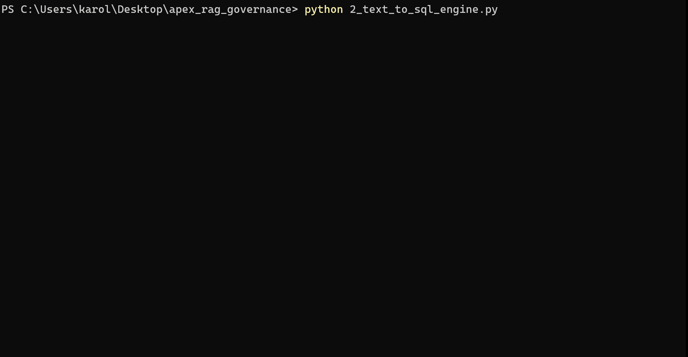

# Governed Text-to-SQL Agent for APEX Activewear
🤖 **Governed AI Serving** (Hybrid RAG Text-to-SQL via `Python`, `Google GenAI SDK`, `ChromaDB`, `BM25`, & `BigQuery`)

## 📊 Executive Summary
**APEX Activewear** is a simulated $48.85M e-commerce dataset powered by a BigQuery and Cloud Dataform Medallion architecture. While the pipeline successfully processes over 436K+ orders, non-technical stakeholders faced a critical bottleneck: extracting actionable insights required waiting on the data team to write custom SQL.

## ⚠️ The Business Problem: Hallucinated Analytics
To enable self-service, stakeholders attempted to use out-of-the-box LLMs to query the data warehouse. However, raw models inherently **hallucinate business logic**. They blindly queried uncertified staging tables, ignored complex financial definitions (like filtering out our 24% return rate), and missed critical "Ghost Revenue" filters, resulting in mathematically incorrect metrics.

## 💡 The Solution: A "Zero-Hallucination" Semantic Layer
I engineered a custom **Retrieval-Augmented Generation (RAG) Governance Agent** that intercepts natural-language questions and safely translates them into production-grade BigQuery SQL. 

**Key Technical Implementations:**
* **Hybrid Search Engine:** Utilizes Reciprocal Rank Fusion (RRF) combining ChromaDB (dense vectors for semantic intent) and BM25 (sparse vectors for exact entity matching).
* **Strict Governance Guardrails:** Dynamically parses BigQuery schemas and Dataform assertions, restricting the AI exclusively to certified `gold_layer` tables.
* **Self-Healing AI Loop:** Integrates a BigQuery dry-run API validation step that catches syntax/schema errors and forces the Gemini 3.7 Flash model to auto-correct before outputting the final query.

**Business Impact:** Stakeholders can now query the warehouse in plain English with mathematical certainty that the generated SQL perfectly matches the CFO's definition of realized revenue.

---

### 🔍 System Action
#### *A sample governed query:*

#### *Ground Truth Verification: Executing the Governed Query in BigQuery*

